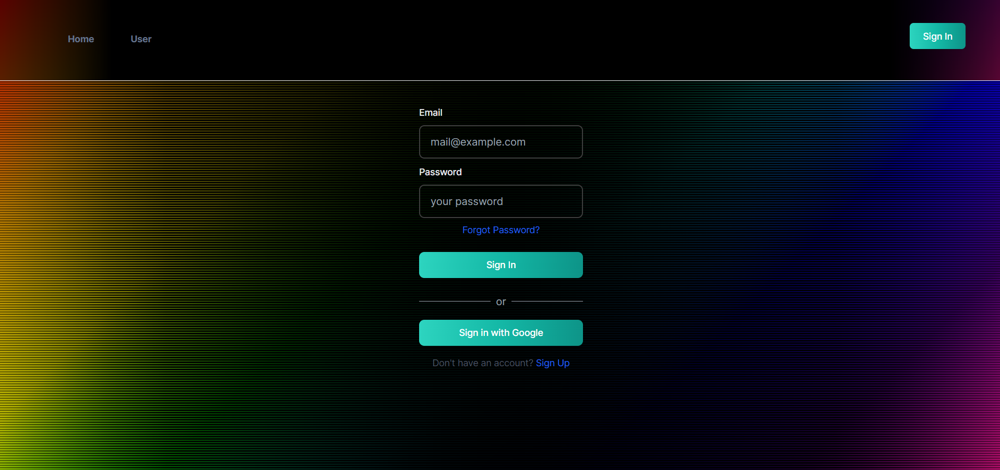

## User Management Application Using Nextauthjs and Nextjs  

## Features
- OAuth: Log in with Google.
- Credential Login: Use email and password.
- SignUp: Register with name, email, password.
- Profile Edit: Change your username and password.
- Password Change: Safely update passwords.
- Routes: Access only for logged-in users/ managers / admins.
- Tenant Mangement: Users are associated with tenants
- Admins can create, edit, delete users and also assign them tenants(for now only admins will assign tenants)

## Environment Setup
Create a .env file in the root directory and add the following variables:

```env
NEXTAUTH_URL="http://localhost:3000"
NEXTAUTH_SECRET="YOUR_NEXTAUTH_SECRET"
RESEND_API_KEY="MAILING_API_KEY"
GOOGLE_CLIENT_ID="YOUR_GOOGLE_CLIENT_ID"
GOOGLE_CLIENT_SECRET="YOUR_GOOGLE_CLIENT_SECRET"
MONGODB_URI="YOUR_MONGODB_URI"
```
## Getting Started

First, run the development server:

```bash
npm run dev
# run this command a couple of time if theres a vulnerability it will be fixed 
npm audit fix
```

# Important
The mailing server i have used will work for developers only so u might not be able to receive mails but you can also use the custom mailing service that i have used by signing-up to [Resend mail](https://resend.com/emails) here is the attachment of how the mails look after receiving

Open [http://localhost:3000](http://localhost:3000) with your browser to see the result.

# Signup with NexthAuth
Different access is defined for users and admin pages, users will be able to add their tenant details in their update profile section after signing-up.
Here is the process



# Forgot Password

After receiving the mail

# Pages for acces for users (RBAC)
The normal application users can access these- (/) home, /user and /profile (to add their tenant data and also to change the password) 


# Login as admin
```
id:admin@gmail.com
pass:admin@123
```
The following are the access pages for admins
### manage-users and tenants
### User Management
/admin to manage user

/admin/add to add user


### Tenant Mangement
/tenant-manegement


